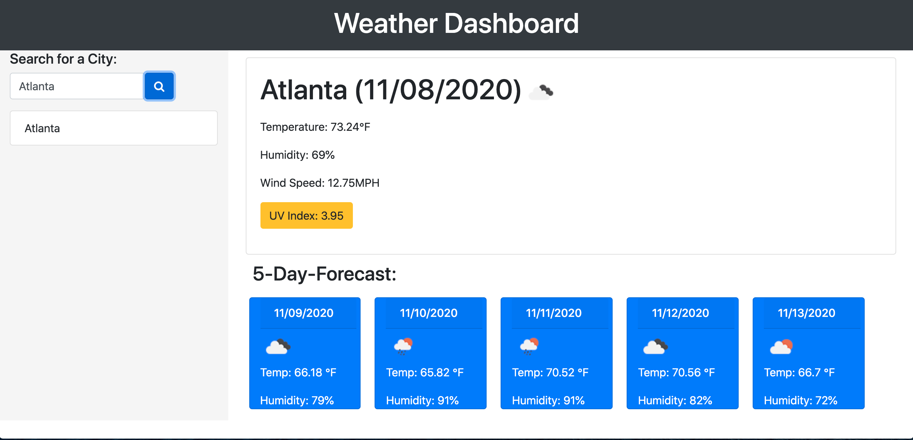

# Weather-Dashboard-App

## Contents

* [A Traveler's Paradise](#a-travelers-paradise)
* [Installation](#installation)
* [Usage](#usage)
* [Mathletes](#mathletes)
* [Credits](#credits)
* [License](#license)

## A Traveler's Paradise

The only thing worse than forgetting something you meant to pack for a trip, is dressing inappropriately for the weather. While the weather app on your phone predicted it would be sunny and warm for your trip to Seattle, the view of the storm clouds from your window seat has you convinced otherwise. If you want to prevent this from happening again, you should rely on the Weather Dashboard website!
This site was created for travelers who want the most up-to-date information regarding the weather in any city around the globe. Not to mention, the website features a five-day forecast which you can use to plan trip outfits, events, and even dining options. Because nothing says vacation like margarita on a bright, sunny beach. So what are you waiting for? Let's start lookin' so we can get to bookin'!

## Installation:

If you would like to use the Weather Dashboard Website, please [click here](https://aikeh2021.github.io/Weather-Dashboard-App/). If you would like to see the Github repository for this project, please [click here](https://github.com/Aikeh2021/Weather-Dashboard-App).

## Usage:

To get started, use the search bar on the top left of the page to look up the weather in any city from around the globe! 

Once you have input a city, you will see two large sections appear on the page. The first will show you the city you have searched, the date, and the current weather conditions in that city at the time of your search. To get updated weather conditions, just refresh the page.

Each time you search for a city, the information will be stored below the search bar in a box with the name of the city on it. To review the weather for a city you have already searched, just click the block with the corresponding city name. The information will reappear on the page with the up-to-date weather for that specific city.

The second section that appears on the page displays the weather information for the next five days. While this is just a glimpse of the weather, the information can still be used to plan events and attire for the upcoming week. For the most accurate information, rely on the weather when displayed in the first section of the website, as it updates hourly.

## Mathletes:

Figuring out the equation to get the 5-Day Forecast API to work took *three hours*. I don't think I've ever furrowed my brow so hard in my life. However, I'm glad I was able to learn how to make the link work so that I would not have to pay for a subscription to access the 16 day forecast API. 
To get it to work, I multiplied the number of days (5) by the number of hours in a day. Under the API's documentation, I saw that the weather will update once every 3 hours. So I took the product of 5 and 24 and divided this by 3. This gave me 40. When I made the ajax call, I received an object with an array of 40 different weather reports. I sifted through each of these keys to find the value I would need to display the weather at 1 hour of the day for each of the days on the blue cards. I chose to broadcast the weather at 3PM as that is around the time that the weather stays somewhat stable for the majority of the day.
This way the user can get a guestimate of what the weather will look like for the next five days. I then created divs and styled them with the card classes on bootstrap. 
I really enjoyed this assignment, as it was aesthetically pleasing and really challenged me to put what I have learned into practice to make something elaborate!

## Credits:

* [How To Format An Input Tag](https://www.w3schools.com/html/html_form_input_types.asp)
* [Kind of Input Types](https://www.w3schools.com/html/html_form_input_types.asp)
* [jQuery CDN](https://code.jquery.com/)
* [How to Use empty() jQuery Method](https://www.w3schools.com/jquery/html_empty.asp)
* [How to Use text() jQuery Method](https://www.w3schools.com/jquery/html_text.asp)
* [How to Use val() jQuery Method](https://www.w3schools.com/jquery/html_val.asp)
* [How to Use push() jQuery Method](https://www.w3schools.com/jsref/jsref_push.asp)
* [How to Use preventDefault JS Method](https://developer.mozilla.org/en-US/docs/Web/API/Event/preventDefault)
* [Open Weather API](https://openweathermap.org/appid)
* [Moment JS Library](https://momentjs.com)
* [UV Index Scale](https://www.epa.gov/sunsafety/uv-index-scale-0)
* [Creating the Weather Icons](https://stackoverflow.com/questions/44177417/how-to-display-openweathermap-weather-icon)
* [Making the Degree Symbol](https://www.36degreesnorth.co/how-to)

## License:

MIT License

Copyright © 2020 Ashley Ikeh

Permission is hereby granted, free of charge, to any person obtaining a copy
of this software and associated documentation files (the "Software"), to deal
in the Software without restriction, including without limitation the rights
to use, copy, modify, merge, publish, distribute, sublicense, and/or sell
copies of the Software, and to permit persons to whom the Software is
furnished to do so, subject to the following conditions:

The above copyright notice and this permission notice shall be included in all
copies or substantial portions of the Software.

THE SOFTWARE IS PROVIDED "AS IS", WITHOUT WARRANTY OF ANY KIND, EXPRESS OR
IMPLIED, INCLUDING BUT NOT LIMITED TO THE WARRANTIES OF MERCHANTABILITY,
FITNESS FOR A PARTICULAR PURPOSE AND NONINFRINGEMENT. IN NO EVENT SHALL THE
AUTHORS OR COPYRIGHT HOLDERS BE LIABLE FOR ANY CLAIM, DAMAGES OR OTHER
LIABILITY, WHETHER IN AN ACTION OF CONTRACT, TORT OR OTHERWISE, ARISING FROM,
OUT OF OR IN CONNECTION WITH THE SOFTWARE OR THE USE OR OTHER DEALINGS IN THE
SOFTWARE.

